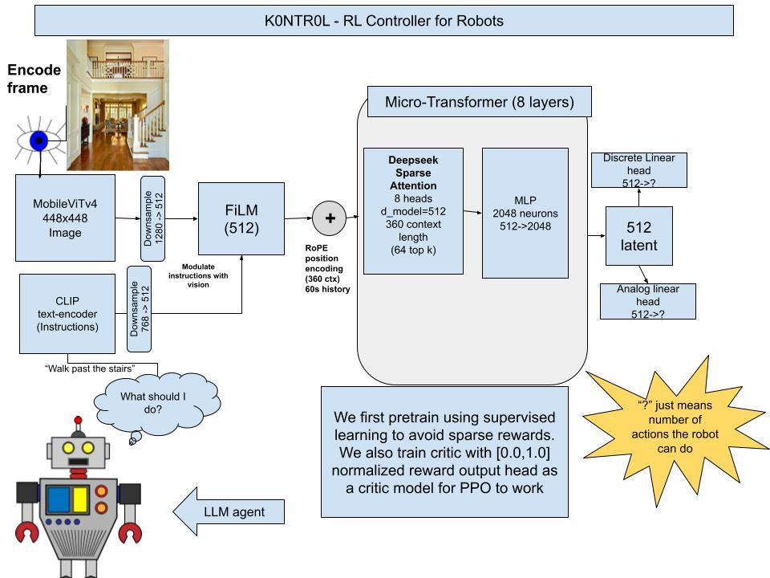
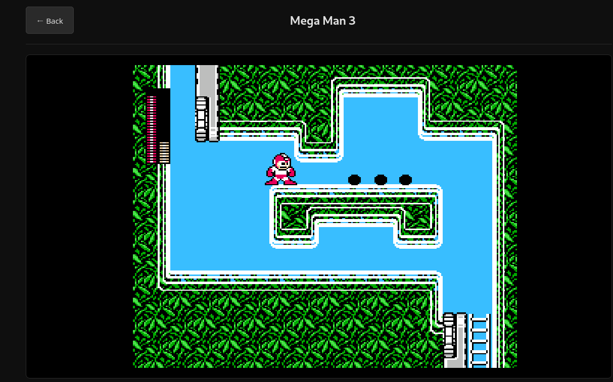

# K0NTR0L: A real-time robotic controller for LLMs

## Abstract

K0NTR0L is a lightweight, real-time Vision-Language-Action (VLA) foundation model designed to execute natural language prompts within real-time environments. The architecture is engineered to prioritize inference latency, spatial grounding, and modularity. The modality of video games was selected due to the readily availablity of real-time video game data. K0NTR0L is initially trained via Behavior Cloning (Supervised Learning) with an eventual transition to Reinforcement Learning. K0NTR0L utilizes a hybrid convolutional-transformer vision backbone, a highly aligned text encoder, and computationally efficient multimodal fusion to map visual states and textual instructions directly to discrete and continuous controller inputs.

## Visual Architecture Diagram

NOTE: While K0NTR0L was designed as a controller for robotics, the training data relies on video game community collected data. This was done because of the issue of sparse rewards in robotic tasks. 
---

## Architectural Overview

The network is composed of independent vision and text towers, a multimodal fusion layer utilizing Feature-wise Linear Modulation (FiLM), a causal transformer backbone, and hybrid action heads.

### 1. Vision Tower: MobileViTv4 (224x224)

The visual encoder processes raw RGB pixel data from the game environment.

* **Design Choice:** MobileViTv4.
* **Rationale:** Standard Vision Transformers (ViTs) pre-trained on datasets like ImageNet suffer from a heavy texture bias and lack inherent spatial inductive biases, making them prone to ignoring geometric hazards or misinterpreting level layouts. Pure Convolutional Neural Networks (CNNs) capture local edges and UI elements well but lack global context. MobileViTv4 is a hybrid architecture. The initial convolutional layers preserve the 2D spatial grid and capture critical geometric boundaries, while the subsequent transformer blocks establish global context (e.g., correlating a key on the left side of the screen to a door on the right).
* **Resolution:** 224x224. While 512x512 was initially considered, it presents a severe computational bottleneck. In real-time control, frames-per-second (FPS) translates directly to decision frequency. Downscaling to 224x224 provides an optimal trade-off, allowing the model to run at high frequencies (Technically capable of 30-60hz but 8hz was selected to reduce training time) without losing meaningful macroeconomic game state data. The latent output size is 1280.

### 2. Language Tower: SigLIP Text Encoder

The text tower processes user instructions (e.g., "Slide through the hole").


* **Design Choice:** SigLIP Text Encoder.
* **Rationale:** My initial prototype utilized BERT-Small. However, BERT is trained via masked language modeling and its latent space is not inherently aligned with **visual** concepts. SigLIP (Sigmoid Loss for Language Image Pre-training) provides text embeddings that are already mathematically aligned with **visual features**, specifically excelling in spatial relationships and short captions. This pre-aligned latent space *drastically* reduces the time required for the fusion layers to map text instructions to visual concepts. The latent output size is 512.

### 3. Multimodal Fusion: Linear Projection and FiLM

To combine the 1280-dimensional vision latent and the 512-dimensional text latent into the transformer backbone, we utilize Feature-wise Linear Modulation.

* **Design Choice:** FiLM.
* **Rationale:** Full cross-attention between high-resolution visual tokens and text tokens is computationally prohibitive for real-time robotic applications. FiLM provides a highly efficient alternative. The 1280-dimensional vision latent is first downsampled to 512 via a linear projection layer. The text embedding is then used to generate scaling and shifting parameters to modulate the visual features. Mathematically, it applies an affine transformation to the visual representation based on the prompt, effectively acting as an attention mechanism that "highlights" prompt-relevant features in the image.

```math
\text{FiLM}(x_v, x_t) = \gamma(x_t) \cdot x_v + \beta(x_t)

```

*(Where ``x_v`` is the visual latent, ``x_t`` is the text latent, and $\gamma$ and ``beta`` are learned linear projections of the text latent).*

### 4. Autoregressive Backbone: Causal Transformer

The core reasoning and temporal processing engine of the agent.

* **Specifications:** $d_{model} = 512$, 8 Attention Heads, 8 Layers.
* **Positional Encoding:** Rotary Position Embedding (RoPE). RoPE provides superior length extrapolation and relative positional awareness compared to absolute sinusoidal encodings.
* **Context Window:** 128 tokens. This expands upon the initially proposed 64 tokens to allow for longer short-term memory (critical for tasks where the objective leaves the immediate field of view). Future iterations may incorporate a Recurrent Memory Token to pass state between inference steps, further decoupling the context window from temporal memory constraints.

### 5. Game-Specific Adaptation: LoRA Modules

To allow the foundation policy to play multiple games without catastrophic forgetting.

* **Design Choice:** Low-Rank Adaptation (LoRA) applied to the Transformer's Query and Value projection matrices.
* **Rationale:** Training a monolithic, generalist agent across vastly different reward landscapes and mechanics is notoriously unstable. By freezing the pre-trained foundation weights and injecting trainable rank-decomposition matrices, K0NTR0L can be fine-tuned for a specific game (e.g., *Minecraft* vs. *Super Mario*) using a fraction of the parameters. These game-specific LoRA weights act as swappable "cartridges" (typically under 5MB) loaded at runtime.

### 6. Action Heads and Supervised Training Phase

The final layers map the transformer's $d_{model}$ output to physical controller state. Because the initial training phase utilizes Behavior Cloning (Supervised Learning), the action heads utilize standard predictive loss functions rather than policy gradients.

* **Analog Head (Continuous):** Linear downsample (512 -> 6) representing two 2D analog sticks and two 1D analog shoulder triggers. Optimized via Mean Squared Error (MSE).
* **Discrete Head (Categorical):** Linear downsample (512 -> 21) representing 21 binary buttons. Optimized via Binary Cross Entropy (BCE).

The composite loss function for the Behavior Cloning phase is defined as:

```math
\mathcal{L}_{\text{total}} = \lambda_{\text{discrete}} \mathcal{L}_{\text{BCE}} + \lambda_{\text{analog}} \mathcal{L}_{\text{MSE}}

```

Where the individual losses are calculated over a batch of $N$ samples:

```math
\mathcal{L}_{\text{MSE}} = \frac{1}{N} \sum_{i=1}^{N} (y_i - \hat{y}_i)^2

```

```math
\mathcal{L}_{\text{BCE}} = -\frac{1}{N} \sum_{i=1}^{N} \left[ y_i \log(\hat{y}_i) + (1 - y_i) \log(1 - \hat{y}_i) \right]

```

**Note on Data Collection:** To prevent distribution shift during inference, the human demonstration dataset must include deliberate noise injection (recovering from suboptimal states) rather than exclusively perfect gameplay. These instructions were given to a community of gamers who submitted hundreds of hours of gameplay to assist training.

## Results
Utilizing NitroGen, an AI capable of playing games without human prompting. However, this approach lead to poor convergence inside the 8hz control loop K0NTR0L utilizes. To mitigate this, Qwen3-VL-2b (Qwen) was utilized. The video below shows Qwen attempting to play Super Mario Bros.


## License

Licensed under the MIT license

## References

```
@misc{perez2017filmvisualreasoninggeneral,
      title={FiLM: Visual Reasoning with a General Conditioning Layer}, 
      author={Ethan Perez and Florian Strub and Harm de Vries and Vincent Dumoulin and Aaron Courville},
      year={2017},
      eprint={1709.07871},
      archivePrefix={arXiv},
      primaryClass={cs.CV},
      url={https://arxiv.org/abs/1709.07871}, 
}

@misc{magne2026nitrogenopenfoundationmodel,
      title={NitroGen: An Open Foundation Model for Generalist Gaming Agents}, 
      author={Loïc Magne and Anas Awadalla and Guanzhi Wang and Yinzhen Xu and Joshua Belofsky and Fengyuan Hu and Joohwan Kim and Ludwig Schmidt and Georgia Gkioxari and Jan Kautz and Yisong Yue and Yejin Choi and Yuke Zhu and Linxi "Jim" Fan},
      year={2026},
      eprint={2601.02427},
      archivePrefix={arXiv},
      primaryClass={cs.CV},
      url={https://arxiv.org/abs/2601.02427}, 
}

@misc{tschannen2025siglip2multilingualvisionlanguage,
      title={SigLIP 2: Multilingual Vision-Language Encoders with Improved Semantic Understanding, Localization, and Dense Features}, 
      author={Michael Tschannen and Alexey Gritsenko and Xiao Wang and Muhammad Ferjad Naeem and Ibrahim Alabdulmohsin and Nikhil Parthasarathy and Talfan Evans and Lucas Beyer and Ye Xia and Basil Mustafa and Olivier Hénaff and Jeremiah Harmsen and Andreas Steiner and Xiaohua Zhai},
      year={2025},
      eprint={2502.14786},
      archivePrefix={arXiv},
      primaryClass={cs.CV},
      url={https://arxiv.org/abs/2502.14786}, 
}

@misc{devlin2019bertpretrainingdeepbidirectional,
      title={BERT: Pre-training of Deep Bidirectional Transformers for Language Understanding}, 
      author={Jacob Devlin and Ming-Wei Chang and Kenton Lee and Kristina Toutanova},
      year={2019},
      eprint={1810.04805},
      archivePrefix={arXiv},
      primaryClass={cs.CL},
      url={https://arxiv.org/abs/1810.04805}, 
}

@misc{kim2024openvlaopensourcevisionlanguageactionmodel,
      title={OpenVLA: An Open-Source Vision-Language-Action Model}, 
      author={Moo Jin Kim and Karl Pertsch and Siddharth Karamcheti and Ted Xiao and Ashwin Balakrishna and Suraj Nair and Rafael Rafailov and Ethan Foster and Grace Lam and Pannag Sanketi and Quan Vuong and Thomas Kollar and Benjamin Burchfiel and Russ Tedrake and Dorsa Sadigh and Sergey Levine and Percy Liang and Chelsea Finn},
      year={2024},
      eprint={2406.09246},
      archivePrefix={arXiv},
      primaryClass={cs.RO},
      url={https://arxiv.org/abs/2406.09246}, 
}
```

